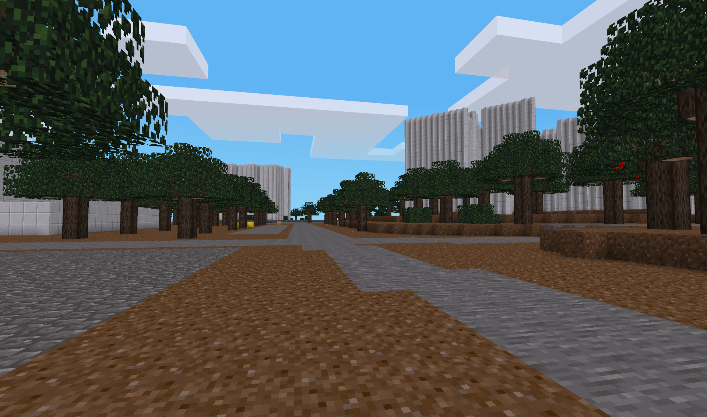
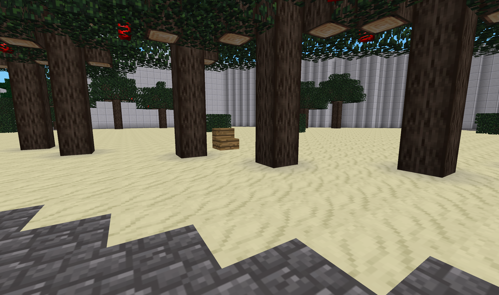
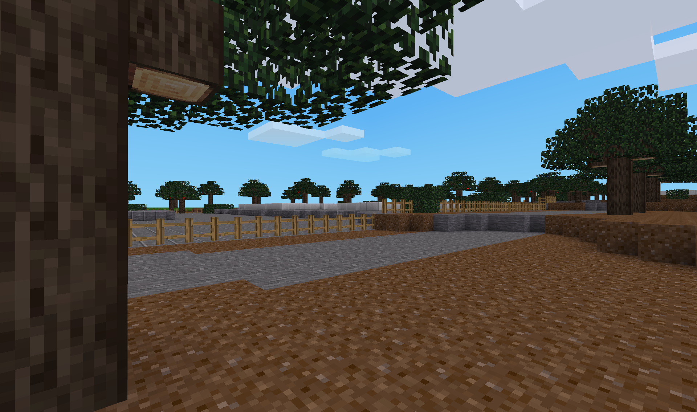
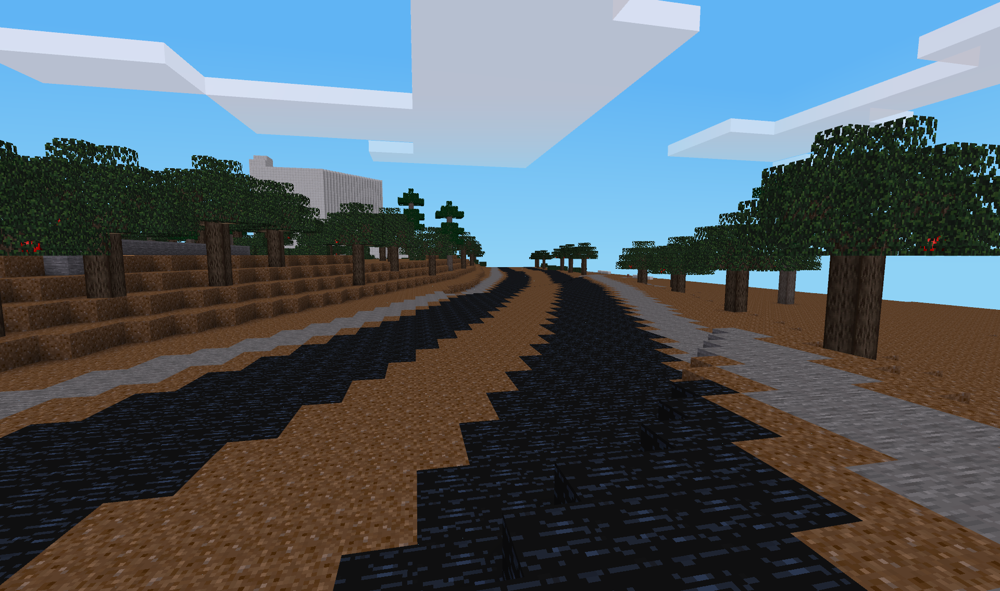

**This is still work in progress**

world2minetest is a tool to generate [Minetest](https://www.minetest.net/) worlds based on publicly available real-world geodata. It was inspired by tools such as [geo-mapgen](https://github.com/Gael-de-Sailly/geo-mapgen).

Currently, the following geodata sources are supported. Heightmaps and .dxf CAD files must use the [EPSG:25832](https://epsg.io/25832) coordinate system.
 * Heightmaps in "XYZ ASCII" format
 * [OpenStreetMap](https://openstreetmap.org), using the [Overpass API](https://overpass-turbo.eu/)
 * .dxf CAD files (trees & bushes only)


Installation
============

 1. Copy this repo's content to your computer, e.g. by cloning:
    ```
    git clone https://github.com/FlorianRaediker/world2minetest.git
    ```
 2. Install the required Python modules:
    ```
    pip3 install -r requirements.txt
    ```


How to use
==========
Generating a Minetest world consists of the following 4 steps. At least one of steps 1-3 is required.

 1. Generate a heightmap.
 2. Use OpenStreetMap data to add details.
 3. Add decoration (trees, bushes) using .dxf data.
 4. Create a `map.dat` file that can be read by world2minetest Mod for Minetest.


## Generating a heightmap
A heightmap can be generated using the `parse_heightmap_xyz.py` script (see `python3 parse_heightmap_xyz.py -h` for details).
First, download ASCII XYZ files and save them to the `data_sources/` directory.

For Hanover (Germany), you can use [this link](https://www.hannover.de/Leben-in-der-Region-Hannover/Verwaltungen-Kommunen/Die-Verwaltung-der-Landeshauptstadt-Hannover/Dezernate-und-Fachbereiche-der-LHH/Stadtentwicklung-und-Bauen/Fachbereich-Planen-und-Stadtentwicklung/Geoinformation/Open-GeoData/3D-Stadtmodell-und-Gel%C3%A4ndemodell/Digitales-Gel%C3%A4ndemodell-DGM1).

Then, run `parse_heightmap_xyz.py` with any files you want to convert into a heightmap:
```
$ python3 parse_heightmap_xyz.py data_sources/path/to/file1.xyz data_sources/path/to/file2.xyz ...
```
This will create a new file `parsed_data/heightmap.dat`.


## Use OpenStreetMap data
Select data using the [Overpass API](https://overpass-turbo.eu/). 
Here is an example query:
```
[out:json][timeout:25][bbox:{{bbox}}];
(
   way;
   node;
);
out body;
>;
out skel qt;
```

Copy the JSON data from the "Data" tab into a new file `data_sources/osm.json`.
Then, parse this data using `parse_features_osm.py` (see `python3 parse_features_osm.py -h` for details).
```
$ python3 parse_features_osm.py data_sources/osm.json
```
This will create a new file `parsed_data/features_osm.json`.


## Add decoration from .dxf files
For geodata saved in .dxf files, `parse_features_dxf.py` can be used (see `python3 parse_features_dxf.py -h` for details).
Currently, only trees are supported.

First, download .dxf files and save them to the `data_sources/` directory.

For Hanover (Germany), you can use [this link](https://www.hannover.de/Leben-in-der-Region-Hannover/Verwaltungen-Kommunen/Die-Verwaltung-der-Landeshauptstadt-Hannover/Dezernate-und-Fachbereiche-der-LHH/Stadtentwicklung-und-Bauen/Fachbereich-Planen-und-Stadtentwicklung/Geoinformation/Open-GeoData/Digitale-Stadtkarten/Stadtkarte-1-1000-SKH1000).

Then, run `parse_features_dxf.py` with any files you want to convert into a heightmap.
For each decoration, you will want to specify a query for [ezdxf](https://ezdxf.readthedocs.io/en/stable/tutorials/getting_data.html#retrieve-entities-by-query-language) to get all entities representing that decoration. Currently, decorations `tree`, `leaf_tree`, `conifer`, and `bush` are available.
Example command (for Hanover's data, see above):
```
$ python3 parse_features_dxf.py data_sources/path/to/file1.dxf data_sources/path/to/file2.dxf ... \
  --query "*[layer=='Eingemessene Bäume' & name=='S220.40']" "tree" \
  --query "*[layer=='Nutzung_ Bewuchs_ Boden' & name=='S220.41']" "leaf_tree" \
  --query "*[layer=='Nutzung_ Bewuchs_ Boden' & name=='S220.43']" "conifer" \
  --query "*[layer=='Nutzung_ Bewuchs_ Boden' & name=='S220.46']" "bush"
```
This will create a new file `parsed_data/features_dxf.json`.


## Putting it all together – creating `map.dat`
See `python3 generate_map.py` for details.
Example usage:
```
$ python3 generate_map.py --heightmap=parsed_data/heightmap.dat --features=parsed_data/features_osm.json --features=parsed_data/features_dxf.json
```
This will save a file `map.dat` to the world2minetest folder, which contains the Mod for Minetest.
Copy this folder to your Minetest installation's `mods/` directory (or create a symlink for convenience).<br>
To generate the map into a world, create a new world in Minetest and, *before playing it for the first time*, activate the `world2minetest` Mod.


Screenshots
===========







License
=======
world2minetest - Generate Minetest worlds based on geodata<br>
Copyright (C) 2021  Florian Rädiker

This program is free software: you can redistribute it and/or modify<br>
it under the terms of the GNU Affero General Public License as published<br>
by the Free Software Foundation, either version 3 of the License, or<br>
(at your option) any later version.

This program is distributed in the hope that it will be useful,<br>
but WITHOUT ANY WARRANTY; without even the implied warranty of<br>
MERCHANTABILITY or FITNESS FOR A PARTICULAR PURPOSE.  See the<br>
GNU Affero General Public License for more details.<br>

You should have received a copy of the GNU Affero General Public License<br>
along with this program.  If not, see <https://www.gnu.org/licenses/>.
